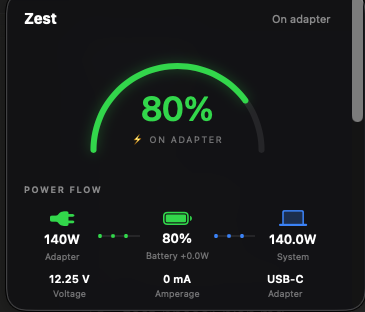
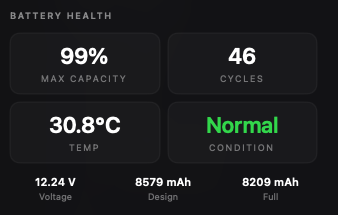

<p align="center">
  <picture>
    <source media="(prefers-color-scheme: dark)"  srcset="design/github/readme-banner-dark-1400x400.png">
    <source media="(prefers-color-scheme: light)" srcset="design/github/readme-banner-light-1400x400.png">
    
  </picture>
</p>

<h1 align="center">Zest</h1>

<p align="center"><b>A native macOS menu bar battery command center. Power flow, health trends, ecosystem batteries, and alerts in one place.</b></p>

<p align="center">
  
  
</p>

<p align="center">
  
  
  
  
  <a href="LICENSE"></a>
</p>

## What it does

- Replaces the built-in battery menu with a faster, richer one.
- Warns before you run low, and nudges at 80 percent.
- Names the apps draining the battery and grades them green, yellow, or red.
- Tracks battery aging with a capacity trendline and a months-to-80-percent projection.
- Shows every Apple device battery in one place.
- Embeds your own Ubersicht widgets as native panels.

## Features

### Menu bar and dropdown

- **iPhone-style battery pill** with the percent inside and a charging bolt on adapter.
- **Display options:** time remaining instead of percent, colors on or off, hide the number, dark glyph for light menu bars.
- **Optional panel readout** in the menu bar, pulled from one of your embedded panels (only when panels are configured, see Configuration).
- **Low Power Mode** state and toggle in the dropdown (toggle needs the optional helper).
- **Scrollable dropdown:** battery, charge state, power flow, health, devices, and the significant-energy list.
- **Command Center window** with Battery, Energy, Devices, Ecosystem, iOS Health, Digest and Alerts sections.

### Alerts

- **Unlimited custom alerts** at any percent, falling or rising.
- **Per-alert configuration:** glow, persistence, sound, on-screen position, color.
- **Notification pills** plus a screen-edge glow on the active screen.
- **Lifecycle alerts:** plugged in, unplugged, charged above 80 percent, fully charged.
- **Per-device low and full alerts.**
- **Quiet hours** with an option to still allow critical low-battery alerts.
- **Alert history:** the last 50 alerts in the Command Center, including the ones quiet hours silenced.

### Battery health

- **Full health readout:** max capacity, cycle count, temperature, condition, voltage, design and full capacity, system thermal pressure.
- **Service recommendation** when capacity or condition warrants it.
- **Health history** with a capacity trendline, cycles per month, and a months-to-80-percent projection.

### Power flow

- **Live wattage diagram** from adapter to battery to Mac, animated.
- **Voltage and amperage** shown live.
- **Underpowered-adapter detection.**

### Energy insights

- **Per-app energy** via powermetrics, with a CPU-share fallback.
- **Live plus 24h, 7d, and 30d averages,** labeled by the real data span collected.
- **Using Significant Energy list** with real app icons.
- **Green, yellow, and red grading** per app and system-wide, with a threshold legend.
- **Misbehaving-app callout** when something runs well above its own baseline.

### Devices and ecosystem

- **Auxiliary device battery:** AirPods with left, right, and case, Magic accessories, and other Bluetooth gear.
- **Curated ecosystem view:** this Mac plus your iPhone, iPad, Watch, AirPods, and other Macs.
- **Presence when battery is unavailable.** iPhones and iPads do not report battery over Bluetooth, so Zest shows connected-via-Bluetooth or on-Wi-Fi presence and remembers it.
- **Scan Bluetooth** to add a paired device with its address filled in.
- **iPhone and iPad battery health** over a USB cable.

### Data and local AI

- **Exports:** battery health CSV, energy CSV, full JSON, and a weekly Markdown report.
- **Local battery digest** from your LM Studio model, fully on-device, with a graceful fallback when LM Studio is not running.
- **Late-night high-drain nudge.**

### Event log for local tools

- **Optional JSON Lines feed** (Settings > General > Event log): plugged in, unplugged, fully charged, charge cycle, battery temperature bands, Low Power Mode, thermal pressure, start and stop. One object per line, UTC timestamps, written to a folder you choose. Off by default; nothing leaves the Mac.

### Bring your own widgets

- **Ubersicht widget panels** rendered as native panels, each running its original pipeline verbatim. Off until you choose a scripts folder in Settings (see Configuration).

### System

- **Menu bar only,** launch at login, single-instance lock, LaunchAgent for autostart and keep-alive.
- **Local only:** no accounts, no license check, no telemetry.

## Stack

- App: Swift, SwiftUI, AppKit; Swift Package, no Xcode project
- Battery data: IOKit power sources and the IORegistry, with system_profiler for the health condition
- Energy data: powermetrics (with the helper) or a ps-based estimate
- Privileged helper: Swift, installed to a root-owned path
- Optional inference: LM Studio on localhost
- Tests: XCTest (`swift test`), run by CI with a release build on every push

## Install

**Requirements:** Apple Silicon, macOS 14 or later.

Download `Zest-v3.0-macOS.zip` from [Releases](https://github.com/ShashankKarpal/zest/releases/latest), unzip, and move `Zest.app` to `/Applications`.

Signed with an Apple Developer ID and notarized by Apple, so it opens without Gatekeeper warnings. No Xcode required. The v3.0 download is from July 2026; everything listed under Unreleased in [CHANGELOG.md](CHANGELOG.md) (alert history, event log, thermal readout, the energy pass, the widget panel gate) is on `main` and in the build-from-source path until v3.1 is notarized.

**Optional root helper (per-app energy and the Low Power Mode toggle):** the app itself never asks for a password. Those two features need `powermetrics`, which macOS only lets root run, so they stay off until you install the small helper yourself from a clone of this repo:

    cd zest-smc && ./build.sh && sudo bash install-helper.sh

Read `install-helper.sh` first (about 40 lines). It installs one root-owned binary and a `sudoers` entry that allows exactly two commands without a password: the helper, and `powermetrics` with the fixed argument vector Zest uses. Nothing else. To undo it: `sudo bash zest-smc/uninstall-helper.sh`. Without the helper, Zest falls back to a `ps`-based estimate for per-app energy and disables the Low Power toggle.

That helper is also why Zest cannot ship on the Mac App Store: the sandbox forbids both root helpers and `powermetrics`, so a notarized direct download is the correct distribution channel.

**Verify it yourself:**

    ditto -x -k Zest-v3.0-macOS.zip .
    xcrun stapler validate Zest.app
    spctl -a -vvv Zest.app

Expect `source=Notarized Developer ID`.

### Build from source

Requires Xcode Command Line Tools.

```bash
git clone https://github.com/ShashankKarpal/zest.git
cd zest
bash build.sh release install
open ~/Applications/Zest.app
```

`build.sh` assembles `Zest.app` inside the checkout; `install` copies it to `~/Applications` with an atomic swap (`ZEST_INSTALL_DIR` to choose another folder). Run the installed copy, not the in-tree one: the next build deletes and recreates the in-tree bundle. Unsigned builds are ad hoc signed and run fine on your own machine. To sign with your own Developer ID, set `ZEST_SIGN_IDENTITY` before building. `swift test` runs the unit tests; the `build` workflow runs them and a release build on every push.

Autostart (points launchd at `~/Applications/Zest.app` when it exists):

```bash
bash scripts/install-launchagent.sh
```

After every `build.sh install`, reload the agent so it runs the new build: `launchctl bootout gui/$(id -u)/com.zest.app; launchctl bootstrap gui/$(id -u) ~/Library/LaunchAgents/com.zest.app.plist` (launchd pins the program's code identity, so `kickstart -k` refuses a rebuilt binary). `scripts/install-launchagent.sh` does exactly that, so re-running it is the simplest reload.

## Configuration

Settings live in `~/Library/Application Support/Zest/config.json`, created on first launch and never committed. Energy history (`energy/`, hourly for seven days then daily, UTC keys), health history, alert history and exports live in the same folder. History keys are UTC, so a timezone change never shifts a bucket.

**Event log** (`eventLogDir`, Settings > General): when set, Zest appends `zest-events.jsonl` in that folder, one line per event such as `{"ts":"2026-09-05T04:47:51Z","source":"zest","host":"...","event":"plugged_in","percent":40,"adapterWatts":96}`. Events: `plugged_in`, `unplugged`, `fully_charged`, `charge_cycle` (cycles, maxCapacityPercent), `battery_temp` (level normal / warm / hot, tempC), `low_power_mode` (on), `thermal_state` (nominal / fair / serious / critical), `zest_start`, `zest_stop` (version). At most one line per event type per minute; the file rotates at 1 MB keeping one previous generation.

**Widget panels are off by default.** The four extra Command Center sections (two account panels, System Vitals, Claude Code) only appear after you point Zest at a folder of panel scripts in Settings > General > Widget panels. Until then Zest never runs a script, and the menu bar readout picker that depends on them is hidden. Even when configured, a panel script runs only while the Command Center is open (or, for the account panels, while the menu bar readout uses it), so panels cost nothing in the background. To build that folder: copy `panels/panels.example.json` to `panels/panels.local.json` (gitignored, machine-specific), edit the widget paths to match your own Ubersicht setup, run `panels/extract-panels.py`, then choose the `panels/` folder in Settings. The scripts run under your account exactly as extracted; Zest never rewrites them.

## Permissions and flags

Each of these is off until granted, and each is a deliberate choice.

- **Low Power Mode toggle and true per-app powermetrics energy need root.** They run through the `zest-smc` helper, which is installed once to a root-owned path with a validated `sudoers` entry granting passwordless invocation of that helper and `powermetrics`. Until that entry exists, the app never calls it. Review `zest-smc/install-helper.sh` before running it.
- **Charge limit is deferred to the macOS 80 percent setting,** the safest option. The shipped app never writes charge state; the helper binary contains a `limit-set` command from earlier experiments that no code path in the app calls.

## Uninstall

1. Quit Zest and delete `Zest.app` (`/Applications` for the release download, `~/Applications` for `build.sh install`).
2. If you installed the LaunchAgent: `bash scripts/uninstall-launchagent.sh` (otherwise a KeepAlive job would keep relaunching a missing app).
3. If you installed the root helper: `sudo bash zest-smc/uninstall-helper.sh` removes the sudoers entry and the helper.
4. App data (config, battery history, energy samples, alert history, exports, and the event log folder if you kept the default) is in `~/Library/Application Support/Zest`; delete it if you want a clean slate.

## Project structure

```
Sources/Zest/       app: menu bar, alerts, battery, energy, devices, data (event log, exports), UI
Tests/ZestTests/    unit tests (swift test); CI runs them plus a release build
zest-smc/           privileged helper and its installer
scripts/            LaunchAgent installer and uninstaller
panels/             widget extraction (generated pipelines are gitignored)
design/             brand assets, tokens, BRAND.md
docs/               screenshots
build.sh            build, assemble, sign; `install` copies to ~/Applications
notarize.sh         notarize, staple and zip a release build
```

## Privacy

Everything is local. No accounts, no telemetry, no license server. The only network use is, if you enable the digest feature, a request to LM Studio on localhost. The optional root helper grants passwordless `sudo` for two fixed commands; see Permissions and flags above for exactly what that means. The optional widget panels run scripts you extracted from your own Ubersicht widgets; whatever those scripts do (some widgets check the network) is theirs, and Zest runs none of them until you choose a folder in Settings. The optional event log writes a plain text file to a folder you choose and nowhere else.

## License

MIT. See [LICENSE](LICENSE).

## Author

Built by Shashank Karpal.

> Designed and built with Claude (Anthropic).
